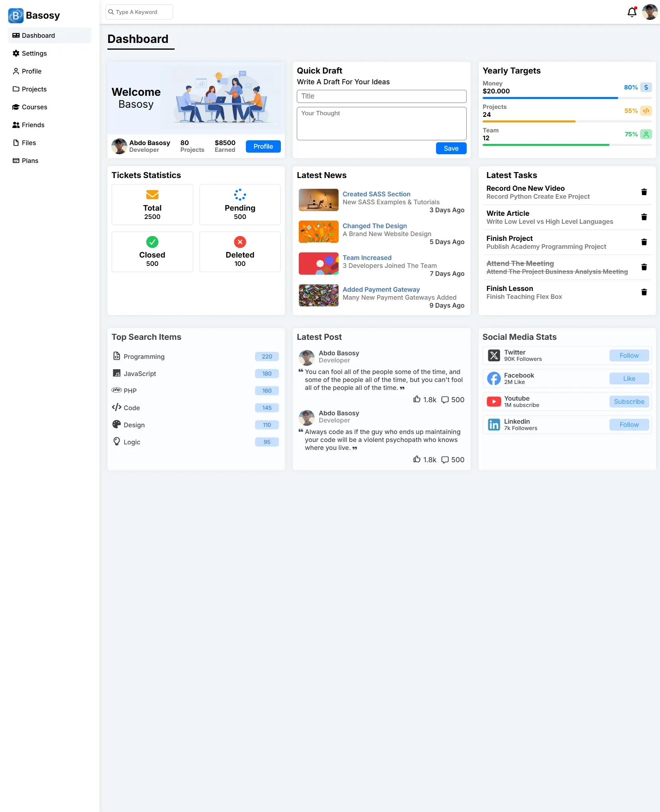

# 🚀 Basosy Admin Dashboard

A modern, high-performance, and fully responsive Admin Dashboard template. Built with a focus on clean code, accessibility, and user experience.

## 🔗 Live Demo
**[View Live Demo 🚀](https://basosytech.github.io/basosy-admin-dashboard/)**

---

## 📸 Preview

---

## ✨ Features
* **8 Complete Pages:** Dashboard, Settings, Profile, Projects, Courses, Friends, Files, and Plans.
* **Fully Responsive:** Optimized for Mobile, Tablet, and Desktop.
* **Advanced CSS3:** Utilizes CSS Variables, Nesting, and Container Queries.
* **High Accessibility:** 100% Lighthouse score.

---

## 🛠️ Built With
* **HTML5** & **CSS3**
* **Font Awesome** & **Google Fonts**

---

## 👨‍💻 Author
**Abdo Basosy**
* GitHub: [@BasosyTech](https://github.com/BasosyTech)
